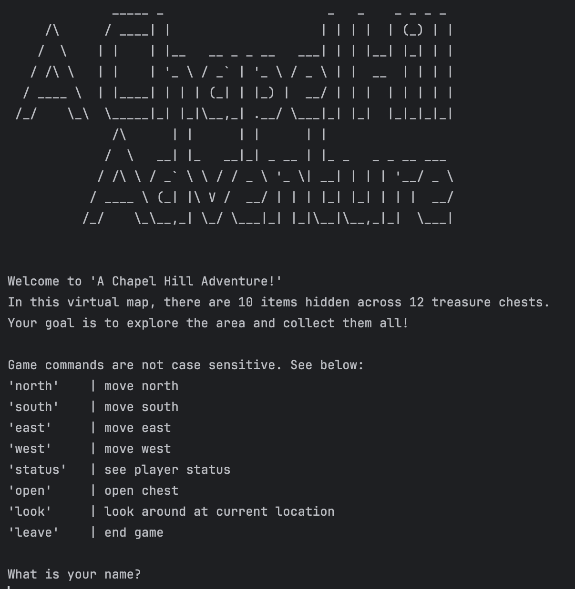

# `Adventure-Game` Directory - A Text-Based Journey into Composition and Aggregation

The `Adventure-Game` directory offers a hands-on approach to understanding **composition** and **aggregation** in object-oriented programming through the development of a classic text-based adventure game. Inspired by early adventure games like *Zork*, this directory guides you through creating an interactive game world where players explore a grid-like map, uncover treasures, and navigate with directional commands like "go north" or "open chest." Through this immersive framework, you’ll learn how to design complex software by breaking it down into manageable, reusable components that work together seamlessly.

## Concept Overview

At the heart of this project is the idea of **composition**, where larger, complex objects are constructed by combining simpler, specialized objects. Instead of relying on inheritance alone, composition allows each part of the game to encapsulate its unique properties and behaviors, making the game modular and easy to extend. Each class within the directory is carefully designed to represent a distinct element of the game world, from the player’s inventory to the map’s grid system.

This directory is structured around interfaces and their implementations, encouraging the development of a flexible, maintainable codebase. By the end, you will see how composition and aggregation make it possible to build a richly interactive, multi-layered adventure game.

## Core Components: The Basic Building Blocks

The initial stage of the game’s design involves creating fundamental components such as `Item`, `Inventory`, and `Position`, which together establish the essential mechanics of the adventure game.

### `Item` and `ItemImpl`: The Game’s Collectible Treasures
Items are objects the player encounters and collects throughout the map, represented by the `Item` interface. Its implementation, `ItemImpl`, contains:
- **Name Field**: Each item has a unique name, managed as a private, immutable field.
- **Methods for Equality and Representation**: Custom `equals()` and `toString()` methods allow items to be compared or displayed effectively.

This setup models any collectible object in the game and establishes a framework for items that can be easily expanded in future versions (e.g., tools, keys, or treasures).

### `Inventory` and `InventoryImpl`: Organizing Collected Items
The `Inventory` interface and its implementation `InventoryImpl` manage collections of items. The inventory uses a `List<Item>` to store items:
- **Add and Retrieve Items**: Players can add items to their personal inventory as they explore, and cells can store items within chests as hidden treasures.

By encapsulating an inventory system, this structure makes it easy to manage collections of items without intermingling other aspects of game logic.

### `Position` and `PositionImpl`: Mapping Locations on a Grid
The `Position` interface, implemented by `PositionImpl`, models each location within the map using Cartesian coordinates:
- **Immutable `(x, y)` Coordinates**: Each position is immutable, providing reliable location tracking across the game map without risk of accidental changes.

By abstracting locations into a separate class, `PositionImpl` simplifies navigation and ensures the game’s grid is consistent and manageable.

## Intermediate Components: Adding Layers to the Game World

In the next stage, these foundational elements combine to create `Cell` and `Player` objects, which bring the game map and player interactions to life.

### `Cell` and `CellImpl`: Defining Points of Interest on the Map
Cells represent individual tiles on the map and encapsulate a location’s name, description, and possible treasure chests:
- **Position, Name, and Description**: Each cell has a unique position and a narrative description, giving it identity within the game world.
- **Chests and Visitation Tracking**: Some cells have a `Inventory` instance acting as a chest that players can open to collect items. Additionally, cells track whether they have been visited, helping create an interactive and dynamic map experience.

By centralizing information about each map location within `CellImpl`, this design keeps the map modular, making it easy to customize and expand.

### `Player` and `PlayerImpl`: Navigating and Collecting Treasures
The `Player` interface and its `PlayerImpl` class represent the player exploring the world:
- **Name, Position, and Inventory**: Players have a name, a position on the map, and a personal inventory to collect items.
- **Movement**: A `move()` method changes the player’s position, allowing them to traverse the map by moving north, south, east, or west.

Through encapsulation, the player object becomes a central, independent character that interacts seamlessly with other parts of the game.

## Advanced Components: Constructing the Game Environment

In the final phase, `Map` and `Game` objects bring together all preceding components to create the game’s overall environment and control its flow.

### `Map` and `MapImpl`: Building the Game World
The `Map` interface and its implementation, `MapImpl`, represent the entire game environment as a 2D grid:
- **Grid of Cells**: Each location in the game is represented by a `Cell`, allowing players to explore a structured and diverse environment.
- **Map Dimensions and Item Count**: The map has defined width and height, and also tracks the total number of hidden items for players to find, setting a clear game objective.

By abstracting the map into its own class, the game’s environment remains flexible and manageable, allowing easy adjustments or expansions to the game world.

### `Game` and `GameImpl`: Bringing It All Together
The `Game` interface, implemented by `GameImpl`, represents the game’s control center:
- **Aggregation of Map and Player**: The `Game` class combines a `Map` and a `Player`, coordinating their interactions and facilitating player actions like moving or collecting items.
- **Game Logic**: The `GameImpl` class interprets player inputs (e.g., “go north” or “open chest”), checking the player’s current position and responding accordingly.

This aggregation of components allows the game to operate as a cohesive whole, processing player commands and modifying the game state without needing direct manipulation of individual components.

## Playing the Game

Once all classes and methods are implemented, the game is ready to play. The player can explore a map, collect treasures, and navigate an interactive world, all within the console. Starting the game in the `Main` class lets players dive into a treasure-hunting adventure, where each move and interaction brings them closer to collecting every hidden item.

With its modular, composition-driven design, this adventure game serves as a memorable introduction to the power of **composition** and **aggregation** in software development, demonstrating how complex interactions can be built from independent, reusable components. As you navigate the `Adventure-Game` directory, you’ll gain firsthand experience in structuring and organizing code to build engaging, interactive experiences.

If you've set up the project correctly, you can now explore the `Adventure-Game` directory and embark on your text-based adventure. You should see something like this:

  

Are you ready to uncover hidden treasures and navigate a mysterious world? Let the adventure begin!
