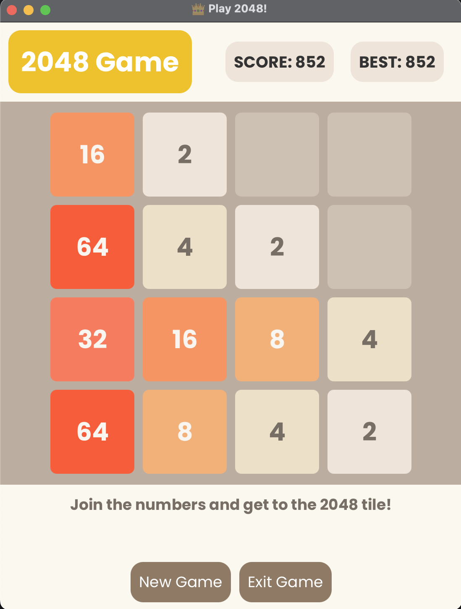

# 2048 Game in JavaFX

This is a JavaFX implementation of the popular **2048 puzzle game**, where the objective is to slide tiles on a grid to combine them into a tile with the value **2048**. This implementation includes animations, styling, and responsive UI design, offering an enjoyable experience for players.

## Table of Contents

- [Overview](#overview)
- [Features](#features)
- [Preview](#preview)
- [Gameplay](#gameplay)
- [Objective](#objective)
- [Controls](#controls)
- [How It Works](#how-it-works)
- [Code Structure](#code-structure)
- [Styling](#styling)
- [Installation](#installation)
- [Usage](#usage)
- [File Structure](#file-structure)
- [Known Issues](#known-issues)
- [Contributing](#contributing)
- [License](#license)
- [Acknowledgments](#acknowledgments)

## Overview

The 2048 game is a single-player sliding block puzzle game where the player combines tiles to create a tile with the value **2048**. The game is played on a 4x4 grid, with tiles that slide in four directions (Up, Down, Left, Right). When two tiles with the same value collide, they merge into a single tile with double the value. The game continues until no valid moves are left.

**Architecture**: The game follows the Model-View-Controller (MVC) pattern, with separate classes for game logic, UI interactions, and rendering. The main class `Game2048` manages the game grid, user inputs, and animations, while the `Main` class initializes the game window and handles event listeners. The game is styled with modern aesthetics, featuring rounded borders, color-coded tiles, and proper alignment of UI elements.

**Technology Stack**: The game is built using JavaFX, a Java library for building rich client applications. It uses FXML for defining the UI layout and CSS for styling the game. The project is managed using Maven, with dependencies for JavaFX and JUnit for testing. Also used CSS for styling the game.

## Features

- **Interactive Gameplay**: Use arrow keys to move tiles (Up, Down, Left, Right).
- **Score Tracking**: Displays current and best scores at the top of the game.
- **Responsive UI**:
  - Animated tile movements and merging effects.
  - Color-coded tiles based on values for easy recognition.
  - Modern styling with rounded borders and proper alignment.
- **Game State Management**:
  - Automatically adds new tiles after each move.
  - Checks for available moves and detects game over conditions.
- **Intelligent Animations**:
  - Smooth scaling animations for tile appearances and merges.
  - Dynamic color updates based on tile values.
- **Build Automation**:
  - Maven project configuration for easy setup and dependency management.
  - JUnit testing for validating game logic and state transitions.

## Preview

### Welcome Screen

<p align="center">
  
</p>

### Game Interface

<p align="center">
  
</p>

### Instructions Interface

<p align="center">
  
</p>

## Gameplay

### Objective

Combine tiles with the same value to create a tile with the value **2048** or higher. The game ends when no valid moves are left.

> **Note:** The game can be won by creating a tile with the value **2048** or higher. The player can continue playing even after reaching the 2048 tile.

### Controls

- **Arrow Keys**:
  - **Up**: Moves all tiles upward.
  - **Down**: Moves all tiles downward.
  - **Left**: Moves all tiles to the left.
  - **Right**: Moves all tiles to the right.
- **New Game** Button: Resets the game.
- **Exit Game** Button: Closes the application.

## How It Works

### Game Mechanics

1. **Sliding and Merging**:
  - Tiles slide in the direction of the arrow key pressed.
  - Tiles with the same value merge into one tile, doubling their value.
  - A tile can merge only once per move.
2. **Adding New Tiles**:
  - After every valid move, a new tile (value `2` or `4`) appears in a random empty spot.
3. **Game Over**:
  - The game checks for possible moves after each action.
  - If no moves are available (all tiles are full and non-mergeable), the game ends.

### Code Structure

The game is built using JavaFX, following Model-View-Controller (MVC) architecture for clean separation of concerns. The key components are:

#### **1. Class: `Game2048`**
This is the main class responsible for rendering the game grid, handling user inputs, managing the board state, and applying animations.

Key Components:
- **Grid Management**:
  - `SIZE`: Size of the grid (default is 4x4).
  - `board`: 2D array representing the logical state of the grid.
  - `tiles`: 2D array of `StackPane` objects representing the UI tiles.
- **UI Elements**:
  - `scoreLabel`: Displays the current score.
  - `bestScoreLabel`: Displays the best score achieved.
- **Tile Colors**:
  - Dynamically updates colors and text based on tile values.
- **Animations**:
  - Smooth scaling animations for tile appearances and merges.

#### 2. **Class: `Main`**
This is the entry point for the application, where the game window is initialized and displayed.

Key Components:
- **JavaFX Setup**:
  - Configures the game window and scene.
  - Loads the FXML file for the game UI.
  - Initializes the game controller (`Game2048`).
- **Event Handling**:
  - Registers key listeners for arrow keys.
  - Handles button actions for New Game and Exit Game.
- **CSS Loading**:
  - Loads the CSS file for styling the game.

#### 3. **Maven XML Configuration: `pom.xml`**
This file contains the Maven project configuration, including dependencies for JavaFX and JUnit.

Key Components:
- **JavaFX Dependencies**:
  - Includes JavaFX modules for controls and FXML.
  - Configures the JavaFX plugin for running the application.
- **JUnit Dependency**:
  - Adds JUnit for testing the game logic.
  - Configures the Maven Surefire plugin for running tests.

#### 4. **Controller, Model, and View Classes**
These classes follow the MVC pattern for managing game logic, UI interactions, and rendering.

Key Components:
- **Controller**:
  - Handles user inputs and game actions.
  - Updates the model and view based on user interactions.
- **Model**:
  - Manages the game state and logic.
  - Checks for valid moves and game over conditions.
- **View**:
  - Renders the game grid and UI elements.
  - Updates the UI based on the model state.

### Styling

The game is styled with modern aesthetics, featuring:
- Rounded borders for tiles and buttons.
- Background colors based on tile values.
- Proper alignment of header (title, score, and best score).
- Button styles with hover effects.

**Color Codes for Tiles:**
- `2`: Light cream (`#eee4da`)
- `4`: Pale beige (`#ede0c8`)
- `8`: Light orange (`#f2b179`)
- Higher values progressively darker and more vibrant.

## Installation

1. **Clone the Repository**:
   ```bash
   git clone https://github.com/hoangsonww/Game-2048-JavaFX.git
   cd Game-2048-JavaFX
   ```

2. **Set Up JavaFX**:
  - Ensure that JavaFX is installed. If not, download JavaFX from the [official site](https://openjfx.io/).
  - Configure JavaFX in your IDE:
    - Add JavaFX libraries to your project.
    - Set JVM arguments to include JavaFX runtime, e.g.:
      ```bash
      --module-path /path-to-javafx/lib --add-modules javafx.controls,javafx.fxml
      ```

3. **Run the Game**:
  - Compile and run the `Main` class.
  - The game window will open, and you can start playing immediately.

## Usage

### Running the Game

1. **Start the Application**:
  - Run the `Main` class from your IDE or terminal.
2. **Play**:
  - Use the arrow keys to move and merge tiles.
  - Aim for a tile value of 2048 (or higher)!
3. **Reset**:
  - Click the **New Game** button to restart the game.
4. **Exit**:
  - Click the **Exit Game** button to close the application.

## File Structure

The project structure is organized as follows:

```
src/
├── org.example.game2048javafx/
│   ├── Controller.java  # Controller for the game
│   ├── Model.java       # Model for the game
│   ├── View.java        # View for the game
│   ├── Game2048.java    # Main game logic and UI
│   ├── Main.java        # Entry point for the application
│   └── resources/       # Optional resources like images or stylesheets
└── README.md            # Comprehensive documentation
```

## Known Issues

1. **Game Freezing**:
  - Ensure animations do not block the main UI thread.
2. **Performance**:
  - For extremely high tile values, UI updates may lag.

## Contributing

Feel free to contribute to this project! Open issues, submit pull requests, or suggest new features.

1. **Fork the Repository**:
   ```bash
   git fork https://github.com/hoangsonww/Game-2048-JavaFX.git
   ```

2. **Create a New Branch**:
   ```bash
   git checkout -b feature/feature-branch-name
   ```

3. **Commit and Push**:
   ```bash
   git add .
   git commit -m "Add your message here"
   git push origin feature/feature-branch-name
   ```

4. **Submit a Pull Request**:
  - Open a pull request on GitHub describing your changes.

5. **We will review your PR** and merge it if it meets the project's guidelines!

## License

This project is licensed under the [MIT License](LICENSE).

## Acknowledgments

- Inspired by the original 2048 game.
- Built with love using JavaFX.
- Author: [Son Nguyen](https://github.com/hoangsonww)

Enjoy playing 2048 in JavaFX! If you encounter any issues, feel free to raise them in the repository.

---

**Happy Coding! 🚀**
